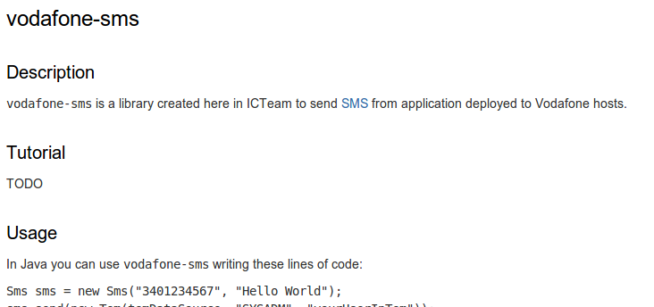

confluence-maven-plugin
=======================

## Summary

  1. [Description](#description)
  1. [Tutorial](#tutorial)
  1. [Usage](#usage)
    1. [Plugin configuration](#usage_plugin_configuration)
    1. [settings.xml example](#usage_settings_xml_example)
  1. [Where to get help](#where_to_get_help)
  1. [Contribution guidelines](#contribution_guidelines)
  1. [Contributor list](#contributor_list)
  1. [Credits, Inspiration, Alternatives](#credits_inspiration_alternatives)

## <a name="description"/>Description

**confluence-maven-plugin** enables you to maintain wiki pages (written in
Markdown syntax) whitin your code and update them to a confluence space.   
A `README.md` in the root of your project is always required.   
The experience should be similar to how you develop in Github (see [Credits,
Inspiration, Alternatives](#credits_inspiration_alternatives) here in this
document for more on this).   
Take a look to the [tutorial](#tutorial) to know how it works.   

The plugin is available on Maven central thanks to [Sonatype](http://www.sonatype.org).

## <a name="tutorial"/>Tutorial

Create a `README.md` file in the root of your project and add following content:

```
vodafone-sms
==============

## Description

`vodafone-sms` is a library created here in ICTeam to send [SMS](http://en.wikipedia.org/wiki/Short_Message_Service)
from application deployed to Vodafone hosts.

## Tutorial

TODO
```

Create a folder `wiki` under `src`.
Inside `src/wiki` create two files:

  * `tem.md`
  * `nplex.md`

Put the content you want in these wiki files.

Declare the plugin in your `pom.xml` (see [Usage](#usage) here in this
document for more on this). E.g.:

```xml
	<plugin>
		<groupId>com.github.sixro</groupId>
		<artifactId>confluence-maven-plugin</artifactId>
		<version>1.0.3</version>
		<executions>
			<execution>
				<id>generate-and-deploy</id>
				<goals>
					<goal>generate</goal>
					<goal>deploy</goal>
				</goals>
				<!-- ONLY IN THIS TUTORIAL... IT IS BETTER TO USE THE DEFAULT PHASE "deploy"-->
				<phase>process-resources</phase>
				<configuration>
					<serverId>my-confluence-server</serverId>
					<endpoint>http://myconfluence:8080/rpc/xmlrpc</endpoint>
					<spaceKey>MYSPACE</spaceKey>
					<parentTitle>Projects</parentTitle>
				</configuration>
			</execution>
		</executions>
	</plugin>
```

where `my-confluence-server` is used to look up in your
`${HOME}/.m2/settings.xml` for credentials to use to connect to your
confluence, `http://myconfluence:8080/rpc/xmlrpc` of `endpoint` parameter is the
URL of your confluence XMLRPC apis, `MYSPACE` is a space you should have on your
confluence and `Projects` is the parent title of a page which content will be
replaced by our `README.md` and where all `src/wiki` pages will be added as
children.

Execute:

```shell
	mvn process-resources
```

You should see on your confluence a page named with the title of the
`README.md` (`vodafone-sms` in this tutorial) and children named with titles
of pages found under `src/wiki`:


If you click on `vodafone-sms` page of your confluence, you should see the
content of your `README.md`:



Now take a look to [Usage](#usage) to know more on configuration parameters, etc...

## <a name="usage"/>Usage

In order to use the plugin you have to add these lines in your `pom.xml`:

```xml
    <plugin>
		<groupId>com.github.sixro</groupId>
		<artifactId>confluence-maven-plugin</artifactId>
		<version>1.0.3</version>
		<executions>
			<execution>
				<id>confluence-deploy</id>
				<goals>
					<goal>deploy</goal>
				</goals>
				<configuration>
					<serverId>myconfluence</serverId>
					<endpoint>http://myconfluence:9090/rpc/xmlrpc</endpoint>
					<spaceKey>MYSPACE</spaceKey>
					<parentTitle>MyParent title</parentTitle>
					<username>ConfluenceUsername</username>
					<password>ConfluencePassword</password>
				</configuration>
			</execution>
		</executions>
	</plugin>
```

In the next chapter you'll have a description for every configuration parameter.

### <a name="usage_plugin_configuration" />Plugin configuration

  * `serverId` is used to look up in your `${HOME}/.m2/settings.xml` for 
                credentials to use to connect to your confluence (optional; if username and password is defined)
  * `endpoint` is the URL of your confluence XMLRPC apis
  * `spaceKey` is a space key found on your confluence
  * `parentTitle` is the parent title of a page which content will be replaced 
                   by your `README.md` content and where all `src/wiki` pages
				   will be added as children
  * `outputDirectory` is the output directory where HTML are generated and where
                      `deploy` goal load pages to deploy (optional; default
					  values is `${project.build.directory}/confluence`)
  * `readme` is the file path of your `README.md` (optional; default value is
             `README.md` in the root of your project)
  * `wikiDirectory` is the directory where to find additional wiki files
	(optional; default value is `src/wiki`)
  * `username` is the username credential to confluence (optional; if serverId is defined)
  * `password` is the password credential to confluence (optional; if serverId is defined)


[Jamie Townsend](http://github.com/jamietownsend) has found an issue related to character encoding on v1.0.1: 
the plugin read markdowns with default character encoding.  
Starting with v1.0.3, the default character encoding is `UTF-8`, but you can change
it defining system variable `markdown.characterencoding`.


### <a name="usage_settings_xml_example" />settings.xml example

Here you can find an example on what to add in your `${HOME}\.m2\settings.xml`.
As you can see we added a `server` with an `id` matching the `serverId` added
below. Then, we configured a `username` and a `password` matching credentials of
our confluence:

```xml
<?xml version="1.0" encoding="UTF-8"?>
<settings xmlns="http://maven.apache.org/SETTINGS/1.0.0" 
          xmlns:xsi="http://www.w3.org/2001/XMLSchema-instance" 
          xsi:schemaLocation="http://maven.apache.org/SETTINGS/1.0.0 http://maven.apache.org/xsd/settings-1.0.0.xsd">
	<servers>
		<server>
			<id>myconfluence</id>
			<username>aUsername</username>
			<password>aPassword</password>
		</server>
	</servers>
</settings>
```

## <a name="where_to_get_help"/>Where to get help

To get help, open an issue. In the future I hope to provide help using something
else...

## <a name="contribution_guidelines"/>Contribution guidelines

All contributions are welcome. The project uses a MIT License (as you can see
in the root of the project).
All you need to do is fork the project and send me a pull-request.
Thanks!

## <a name="contributor_list"/>Contributor list

  * [Sixro](http://github.com/sixro)
  * [jamietownsend](http://github.com/jamietownsend)

## <a name="credits_inspiration_alternatives"/>Credits, Inspiration, Alternatives

The main reason I created this tool, is the possibility to have on my company
projects the same "feeling" I have with Github projects. I would like to have
a `README.md` in the root of my company projects and I would like to be able to
read the same content on a confluence space.

Another reason is the inspiration I had when I read this post of 
Tom Preston-Werner on [Readme Driven Development](http://tom.preston-werner.com/2010/08/23/readme-driven-development.html).

An alternative to this project is [maven-confluence-plugin](https://code.google.com/p/maven-confluence-plugin/).
It is different from **confluence-maven-plugin**, because it is more involved with maven site style. So
it is useful if what you need is a site style page on your confluence space.
